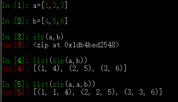
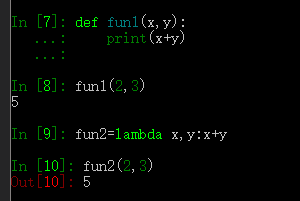
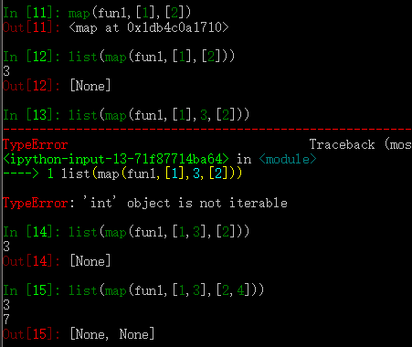
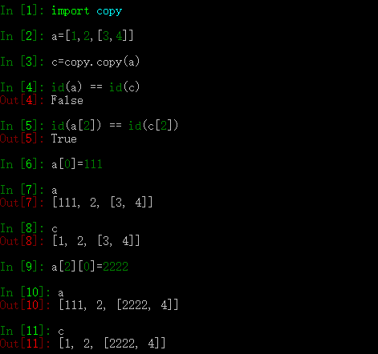

# python的一些补充学习

## 一. zip、map、lambda 的学习



zip 
类似迭代器，将多个元素属性竖向合并，可以多个参数一起使用



lambda 
类似于定义一个简单的方程，lambda 参数：函数



map
是函数和参数合起来的运算，如上图，1+2 ，3+4 这样的

## 二. copy和deepcopy 的学习



copy.copy
只更改浅层的数据，copy的是内存中地址的引用，所以两个数据的id会相同，更改一个另外一个也会随之改变

```python

# 1.使用copy()拷贝不可变对象
val1 = 1000
val2 = copy.copy(val1)
print(val1,val2)##1000 1000
print(id(val1),id(val2))#8551568 8551568
# 2.使用copy（）拷贝可变对象
ls1 =[1,2,3,4]
ls2 = copy.copy(ls1)
ls1.append(5)
print(ls1,ls2)  #[1, 2, 3, 4, 5] [1, 2, 3, 4]
 
# 看上去copy()函数效果和deepcopy()效果一样，可变对象拷贝后值也没有随着一个对象的修改而修改。
# 然后真实情况真是这样嘛？请看下面的案例，同样是拷贝可变对象。
 
origin = [1, 2, [3, 4]]
cop1 = copy.copy(origin)
cop2 = copy.deepcopy(origin)
origin[2][0] = "hey!"  #修改数据源的值
print(cop1,cop2) #[1, 2, ['hey!', 4]] [1, 2, [3, 4]]
 
# 很显然这时copy（）函数拷贝的值随着原对象的值修改了，而deepcopy()的值没有随着原对象的值修改。
# 主要是因为deepcopy会将复杂对象的每一层复制一个单独的个体出来对于copy（）函数要慎用，慎用。
```

copy.deepcopy
完完全全拷贝，谁变了也不会影响谁，跟原来的数据没有关系，都是独立的地址独立的更改，不随着谁的改变而改变，

## 三. 多线程、多进程

### 3.1 多线程

#### 1.概念

假设有一个工作，我们把工作分成五部分，我们再找5个人，在各个部分同时进行工作，这样类似的就是多线程，将一个任务分成几段，然后同时运行各段上的任务，这样效率会提高。

## 四. tkinter窗口

### 4.1 概念

是一个GUI界面，python特定的GUI界面的图像窗口，可以编辑

## 五、pickle(pikou)存放数据

[pickle](code/pickle.py)
