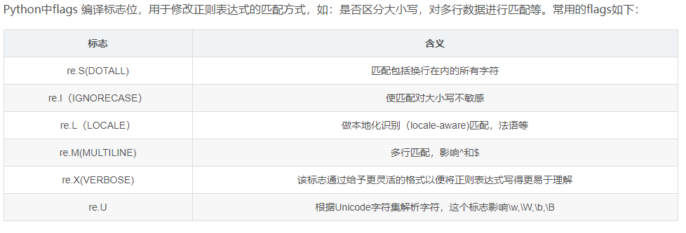

<!-- TOC -->

- [正则表达式](#正则表达式)
    - [说明](#说明)
    - [一、导入模块](#一导入模块)
    - [二、简单python匹配](#二简单python匹配)
    - [三、 用正则表达式寻找匹配](#三-用正则表达式寻找匹配)
    - [四、匹配多种可能](#四匹配多种可能)
    - [五、匹配更多种可能](#五匹配更多种可能)
    - [六、 特殊种类匹配](#六-特殊种类匹配)
        - [1. 数字](#1-数字)
        - [2. 空白(多个空格组成的)](#2-空白多个空格组成的)
        - [3. 所有字母数字和_(下划线)](#3-所有字母数字和_下划线)
        - [4. 空白字符(只有一个空格)](#4-空白字符只有一个空格)
        - [5. 特殊字符 任意字符](#5-特殊字符-任意字符)
        - [6. 句首和句尾](#6-句首和句尾)
        - [7. 是否(找得到，找不到都输出)](#7-是否找得到找不到都输出)
        - [8. 多行](#8-多行)
        - [9. 0或多次(找得到，找不到都输出)](#9-0或多次找得到找不到都输出)
        - [10. 1或多次](#10-1或多次)
        - [11. 可选次数](#11-可选次数)
        - [12. group 组](#12-group-组)
        - [13. 寻找所有匹配](#13-寻找所有匹配)
        - [14. 替换、分裂](#14-替换分裂)
        - [15. compile(康π奥)](#15-compile康π奥)

<!-- /TOC -->

# 正则表达式

## 说明

<font face="微软雅黑" size=5>
此文章，是根据莫烦python老师的视频编写的，如有侵权，请联系我删除.莫烦python的地址:
</font>

<font face="黑体" size=5>[莫烦python](https://morvanzhou.github.io/tutorials/data-manipulation/scraping/)</font>

## 一、导入模块

    import re

## 二、简单python匹配

```python
a = 'cat'
b = 'bird'
string = 'dog and cat'
print(a in string)
print(b in string)

```

输出结果：  
True  
False  

## 三、 用正则表达式寻找匹配

```python
import re


a = 'cat'
b = 'bird'
string = 'dog and cat'
print(re.search(a, string))
print(re.search(b, string))

```

输出结果：  
<re.Match object; span=(8, 11), match='cat'>  
None  

## 四、匹配多种可能

```python
import re


# 匹配正则表达式，r使之成为正则表达式，[]里面可以是一个或者多个，既可以匹配ran又可以匹配run，请看代码
a = r"r[au]n"
#匹配以r开头，中间是a或者u都可以，在以n结尾的字符串
print(re.search(a, "dog runs to cat"))

```

输出结果：  
<re.Match object; span=(4, 7), match='run'>

## 五、匹配更多种可能

```python
import re


# 匹配正则表达式，r使之成为正则表达式，[]里面可以是一个或者多个，既可以匹配ran又可以匹配run，请看代码
a = r"r[au]n"
# 匹配以r开头，中间是a或者u都可以，在以n结尾的字符串
print("1")
print(re.search(a, "dog runs to cat"))
# 匹配以r开头，中间是大写(A-Z)的任意字母都可以，在以n结尾的字符串
print("2")
print(re.search(r'r[A-Z]n', "dog runs to cat"))
# 匹配以r开头，中间是小写（a-z）的任意字母都可以，在以n结尾的字符串
print("3")
print(re.search(r'r[a-z]n', "dog runs to cat"))
# 匹配以r开头，中间是0-9的任意数字都可以，在以n结尾的字符串
print("4")
print(re.search(r'r[0-9]n', "dog runs to cat"))
# 匹配以r开头，中间是A-Z或0-9任意字母数字都可以，在以n结尾的字符串
print("5")
print(re.search(r'r[a-z0-9]n', "dog runs to cat"))
```

输出结果：  
1  
<re.Match object; span=(4, 7), match='run'>  
2  
None  
3  
<re.Match object; span=(4, 7), match='run'>  
4  
None  
5  
<re.Match object; span=(4, 7), match='run'>  

## 六、 特殊种类匹配

### 1. 数字

```python
import re


print("\d")
# \d: 代表匹配r和n 中间只要是数字，就可以匹配到
print(re.search(r"r\dn", "run r4n"))
print("\D")
# \D: 代表匹配r和n 中间只要是不是数字，就可以匹配到
print(re.search(r"r\Dn", "run r4n"))
```

输出结果：  
\d  
<re.Match object; span=(4, 7), match='r4n'>  
\D  
<re.Match object; span=(0, 3), match='run'>

### 2. 空白(多个空格组成的)

```python
import re


# \s:[\t:是tab键 \n：换行 \r：回车键 \f:换页 \v：垂直制表符] 都是一些输出空符号的
# 匹配所有包含空白符的字符串
print("\s")
print(re.search(r"r\sn", "r\nn r4n"))
# \S: 匹配所有非包含空白符的字符串
print("\S")
print(re.search(r"r\Sn", "r\nn r4n"))

```

输出结果：  
\s  
<re.Match object; span=(0, 3), match='r\nn'>  
\S  
<re.Match object; span=(4, 7), match='r4n'>

### 3. 所有字母数字和_(下划线)

```python
import re


# \w: 匹配所有包含任意大小写字母、数字和下划线_的字符串[a-zA-Z0-9]
print("\w")
print(re.search(r"r\wn", "r\nn r4n"))
# \W: 匹配所有不包含任意大小写字母、数字和下划线_的字符串
print("\W")
print(re.search(r"r\Wn", "r\nn r4n"))
```

输出结果：  
\w  
<re.Match object; span=(4, 7), match='r4n'>  
\W  
<re.Match object; span=(0, 3), match='r\nn'>

### 4. 空白字符(只有一个空格)

```python
import re


# \b: 匹配run前后各带一个空格的字符串
print("\\b")
print(re.search(r'\bruns\b', "dog runs to cat"))
# \B: 匹配run前后不带一个空格的字符串
print("\B")
print(re.search(r"\B runs \B", "dog   runs   to cat"))

```

输出结果：  
\b  
<re.Match object; span=(4, 8), match='runs'>  
\B  
<re.Match object; span=(5, 11), match=' runs '>

### 5. 特殊字符 任意字符

```python
import re


# \反斜杠：匹配反斜杠是要在添加一个反斜杠，进行转义
print("\\")
print(re.search(r"runs\\", "runs\ to me"))
# . 点：匹配任何除了换行的其他字符
print(".")
print(re.search(r"r.ns", "r[ns\ to me"))

```

输出结果：  
\  
<re.Match object; span=(0, 5), match='runs\\'>  
.  
<re.Match object; span=(0, 4), match='r[ns'>

### 6. 句首和句尾

```python
import re


# ^ :从句首开始一直匹配到 g
print('^')
print(re.search(r"^dog", "dog   runs   to cat"))
# $ :从 c 开始一直匹配到句尾
print('$')
print(re.search(r"cat$", "dog   runs   to cat"))

```

输出结果：  
^  
<re.Match object; span=(0, 3), match='dog'>  
$  
<re.Match object; span=(16, 19), match='cat'>  

### 7. 是否(找得到，找不到都输出)

```python
import re


# ? :是否,这个数据是否包含我想要的数据，不管包含还是不包含，都会输出
print(re.search(r"Mon(day)?", "Monday"))
print(re.search(r"Mon(day)?", "Mon"))

```

输出结果：  
<re.Match object; span=(0, 6), match='Monday'>  
<re.Match object; span=(0, 3), match='Mon'>

### 8. 多行

```python
import re


# 多行匹配,用^无法匹配多行下，以I开头的字符串，但是立一个flags，flags=re.M(MULTILINE)
string ='''
dog runs to cat.
I run to dog.
'''
print(re.search(r"^I", string))
print(re.search(r"^I", string, flags=re.M))

```

输出结果：  
None  
<re.Match object; span=(18, 19), match='I'>

还有以下几种：


### 9. 0或多次(找得到，找不到都输出)

```python
import re


# *: 出现0次或者多次
print(re.search(r"ab*", "a"))
print(re.search(r"ab*", "abbbbbbb"))

```

输出结果：  
<re.Match object; span=(0, 1), match='a'>  
<re.Match object; span=(0, 8), match='abbbbbbb'>

### 10. 1或多次

```python
import re


# +: 出现1次或者多次，匹配到的输出，0次匹配不到的输出none
print(re.search(r"ab+", "a"))
print(re.search(r"ab+", "abbbbbbb"))

```

输出结果：  
None  
<re.Match object; span=(0, 8), match='abbbbbbb'>

### 11. 可选次数

```python
import re


# {n,m}: 出现n-m次
print(re.search(r"ab{2,10}", "a"))
print(re.search(r"ab{2,10}", "abbbbbbb"))

```

输出结果：  
None  
<re.Match object; span=(0, 8), match='abbbbbbb'>

### 12. group 组

```python
import re


# 首先，是分成了两组，(\d+)和Date:(.+)，group()代表是不分组，全部输出，组号从1开始
# (\d+) 代表匹配数字出现了一次或者多次的字符串
# 
match = re.search(r"(\d+), Date:(.+)", "ID:021523, Date:Feb/29/3/2019")
print(match.group())
print(match.group(1))
print(match.group(2))
print("1-------------------------------")
# 为了避免出现混多组，用序号标记容易混淆，我们也可以给组加上名字?<name>
match1 = re.search(r"(?P<id>\d+), Date:(?P<date>.+)", "ID:021523, Date:Feb/29/3/2019")
print(match1.group('id'))
print(match1.group('date))

```

输出结果：  
021523, Date:Feb/29/3/2019  
021523  
Feb/29/3/2019  
1-------------------------------  
021523  
Feb/29/3/2019  

### 13. 寻找所有匹配

```python
import re


# findall 匹配所有符合的字符串
print(re.findall(r"r[ua]n", "run ran ren"))
print("1---------------------------")
# | :或者的意思 or
# 只会输出u或者a
print(re.findall(r"r(u|a)n", "run ran ren")
# 输出完整的
print(re.findall(r"(run|ran)", "run ran ren")

```

输出的结果：  
['run', 'ran']  
1---------------------------  
['u', 'a']  
['run', 'ran']  

### 14. 替换、分裂

```python
import re


# sub 替换将正则表达式替换成其他字符串
print(re.sub(r"r[ua]n", "cathes","run ran ren"))
# split 分裂，将匹配到的符号两边的数据，分割开来
# \. 是转义. 使其匹配
print(re.split(r"[,;\.]", "a;b,c.d;e"))

```

输出结果：  
cathes cathes ren  
['a', 'b', 'c', 'd', 'e']

### 15. compile(康π奥)

先将正则表达式编译，在匹配到字符串

```python
import re


compiled_re = re.compile(r"r[ua]n")
print(compiled_re.search("dog ran to cat"))

```

输出结果：  
<re.Match object; span=(4, 7), match='ran'>