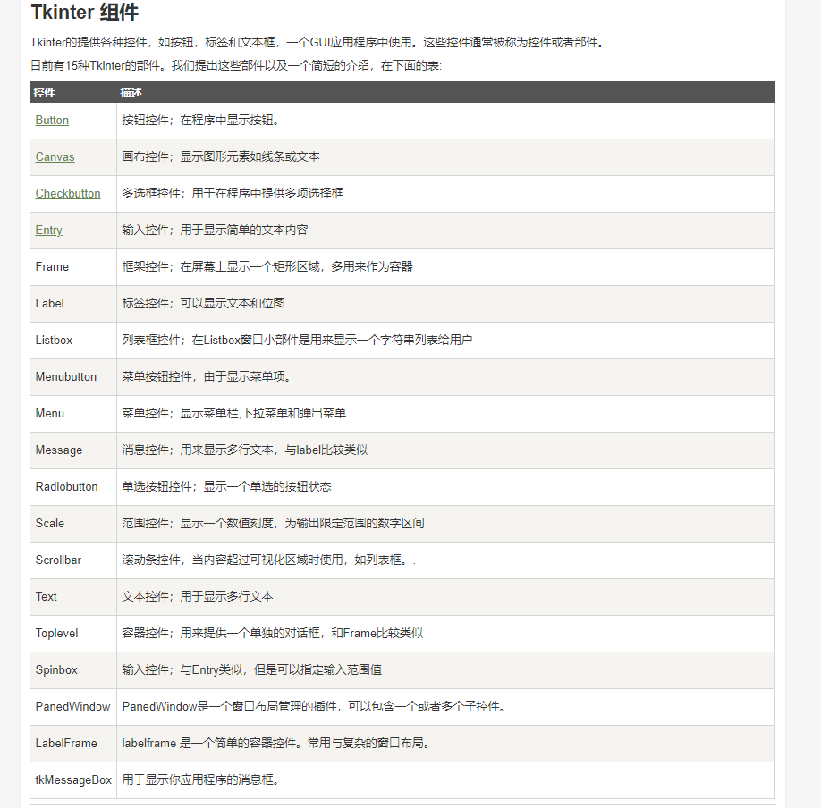
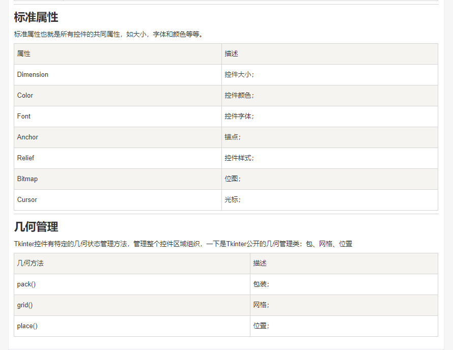

# TKINTER  GUI窗口化工具

## 一、tkinter的基本介绍

1. 首先要先import
2. 引用Tk
3. 窗口名字 .titile 尺寸，geometry
4. tkinter一些属性(图片来源于[菜鸟编程](http://www.runoob.com/python/python-gui-tkinter.html))

5. 定义第一个属性 label和button
[具体代码](code/label_button.py)
